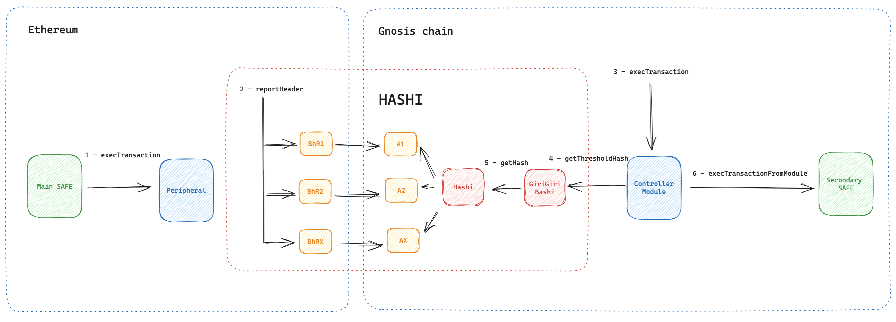

# Safe Crosschain


[](https://github.com/crosschain-alliance/safe-crosschain/blob/main/LICENSE)



## Overview


Safe Crosschain is a mechanism crafted to empower users with the ability to control a Safe across different blockchains using Hashi. The idea is to have a main Safe which can be controlled by peripheral Safes using storage proofs verification against a block header propagated using Hashi.

&nbsp;

***

&nbsp;

## How it works

1. Begin by deploying two Safes - the main Safe and the `Peripheral` Safe. Attach a module called `ControllerModule` to the main Safe.

2. Users wishing to execute a cross-chain transaction should call `execTransaction` on the `Peripheral` Safe which just writes in storage a commitment corresponding to the used function parameters.

3. After the transaction is included in a block, a relayer propagates the corresponding block header to the chain where the main Safe is deployed.

4. Once all bridges have stored the block header in their corresponding adapters, the user can call `execTransaction` on the `ControllerModule`, providing the storage proof. The `ControllerModule` verifies the proof against the block header propagated with Hashi, and subsequently calls `execTransaction` on the Main Safe using `execTransactionFromModule`.


&nbsp;

***

&nbsp;

## Installation and Usage

### Prerequisites

Ensure you have [Node.js](https://nodejs.org/) and [npm](https://www.npmjs.com/) installed.

### Clone the Repository

```bash
git clone https://github.com/crosschain-alliance/safe-crosschain.git
cd sj-core-contracts
```

### Install Dependencies

```bash
npm install
```

### Compile Contracts

```bash
npm run compile
```

&nbsp;

***

&nbsp;

## Testing

Before running the tests, make sure you've set up the required environment variables.

```bash
npm run test
```

&nbsp;

***

&nbsp;

## Contribution

Pull requests are welcome. For major changes, please open an issue first to discuss what you would like to change.

&nbsp;

***

&nbsp;

## License

This project is licensed under the TODO License - see the [LICENSE](LICENSE) file for details.


&nbsp;

***

&nbsp;
## Contact

For any inquiries, issues, or feedback, please [raise an issue on GitHub](https://github.com/crosschain-alliance/safe-crosschain/issues) or contact the team through our [official website](#).

&nbsp;

***

&nbsp;

## ⚠️ Security and Development Disclaimer

All contracts in this repository are still under active development. Although Safe Junction endeavors to ensure the highest level of security and reliability, the evolving nature of software development means that these contracts may contain unforeseen issues or vulnerabilities.

While we strive to provide a secure and robust platform through the integration of multiple oracles and other advanced features, it's crucial for users, developers, and integrators to understand the inherent risks associated with smart contracts and blockchain protocols.

All contracts have undergone thorough testing and reviews, but this doesn't guarantee they are free from errors or security vulnerabilities. Use them at your own risk.